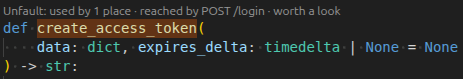
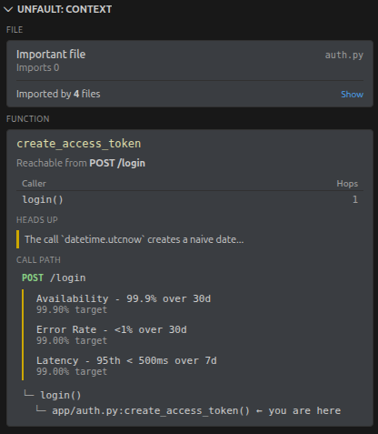
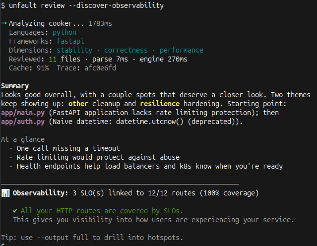
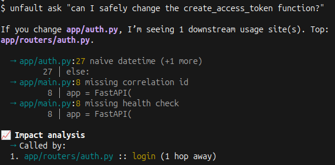

  

<h3 align="center">Cognitive context for the code you work on everyday.</h3>

  <a href="https://unfault.dev/docs">Documentation</a> •
  <a href="https://unfault.dev/docs/installation">Get Started</a> •
  <a href="https://marketplace.visualstudio.com/items?itemName=unfault.unfault">VS Code Extension</a>

---

You know that moment when you're about to change a function and wonder: *"What else does this touch?"*

Unfault answers that question before you find out the hard way.

## See What Your Code Actually Does

When you're editing `process_payment()`, you probably want to know:

- 🔗 **Who calls this?**: 3 routes, 2 functions
- 🎯 **What SLOs are related to your route?**: 99.9% availability on `/checkout`  
- ⚠️ **What's missing?**: No timeout on the external API call

Instead of grepping, tracing, and hoping: you just see it.

## It Works Where You Work

**In VS Code**: context follows your cursor

  
   
  <em>Compact hints above functions show what matters</em>

  
   
  <em>Get context as you navigate your code</em>

**In your terminal**: review before you push

  
   
  <em>Runs in no time, flags what is worth looking</em>

  
   
  <em>Ask natural questions about your code</em>

Use this context with your favourite AI too.

## What's Here

| Repository | What it does | License |
|------------|--------------|---------|
| **[cli](https://github.com/unfault/cli)** | The brain: analysis, CI integration, LSP server | MIT |
| **[core](https://github.com/unfault/core)** | Parsing and graph building | MIT |
| **[vscode](https://github.com/unfault/vscode)** | VS Code extension | MIT |

## Supports Your Stack

Python · Go · Rust · TypeScript · JavaScript

FastAPI · Flask · Django · Express · Gin: with framework-aware route detection.

## Your Code Stays With You

Source code never leaves your machine. We receive a semantic graph: imports, calls, relationships: not your actual code. [Privacy details →](https://unfault.dev/privacy)

---

  <b>Write with greater insights.</b>
    
  <a href="https://unfault.dev/docs/installation">Get Started →</a>

